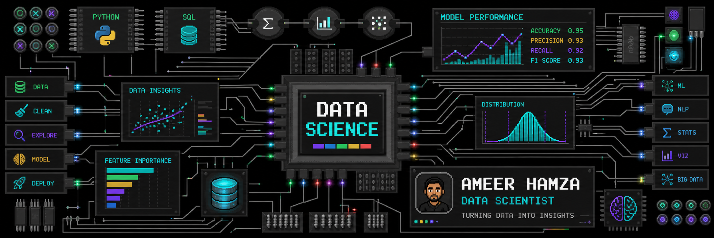

<p align="center">
  
</p>

<h1 align="center">Hi there 👋🏻, I'm Ameer Hamza</h1>

<h3 align="center">
  Data Scientist • Data Analyst • Machine Learning Engineer
</h3>

<p align="center">
  I build data-driven systems using machine learning, analytics, deep learning, dashboards, MLOps, and generative AI.
</p>

<p align="center">
  <a href="mailto:ameerhamzarashid.uk@gmail.com">
    
  </a>
  <a href="https://www.linkedin.com/in/ameerhamza78644">
    
  </a>
  <a href="https://github.com/ameerhamzarashid">
    
  </a>
  <a href="https://ds-portfolio-eight.vercel.app">
    
  </a>
</p>
---

## 👨🏻‍💻 About Me

I'm an MSc Data Science graduate, Data Scientist and Data Analyst with hands-on experience in machine learning, deep learning, dashboards, forecasting, MLOps and applied AI systems.

- 🌱 Currently building advanced data science, machine learning and AI portfolio projects  
- 🤝🏻 I’m looking to collaborate on data analytics, ML, computer vision, NLP, RAG and SaaS-style AI products  
- 🎯 Current goal: secure a full-time Data Analyst, Data Scientist or ML Engineer role in the UK  
- 🧠 Research focus: communication-efficient federated learning for 6G mobile edge computing  
- 📊 I enjoy turning raw data into clean insights, dashboards, models and decision-ready outputs  
- ✉️ Reach me at: **ameerhamzarashid.uk@gmail.com**  
- ⚡ Fun fact: I like building projects that look good and solve real problems  

---

## 🌐 Connect With Me

<p align="left">
  <a href="mailto:ameerhamzarashid.uk@gmail.com">
    
  </a>
  <a href="https://www.linkedin.com/in/ameerhamza78644">
    
  </a>
  <a href="https://github.com/ameerhamzarashid">
    
  </a>
</p>

---

## 🧠 Languages and Tools

### Core Programming & Data

<p align="left">
  
</p>

### Machine Learning, Deep Learning & AI

<p align="left">
  
</p>

<p align="left">
  
  
  
  
  
  
</p>

### Business Intelligence & Analytics

<p align="left">
  
  
  
  
  
  
</p>

### MLOps, Cloud & Deployment

<p align="left">
  
</p>

<p align="left">
  
  
  
  
</p>

### Generative AI & LLM Systems

<p align="left">
  
  
  
  
  
  
</p>

---

## 🚀 Featured Projects

<table>
  <tr>
    <td width="50%">
      <h3>Communication-Efficient Federated Learning for 6G MEC</h3>
      <p>Research project for dynamic task offloading in 6G-oriented multi-server edge networks using federated learning, DQN and ns-3 simulation.</p>
      <p><strong>Tech:</strong> Python, C++, ns-3, Federated Learning, DQN, Edge Computing</p>
    </td>
    <td width="50%">
      <h3>Alzheimer Detection Using Deep Learning</h3>
      <p>Deep learning project for Alzheimer’s disease detection using CNN-based medical image classification models.</p>
      <p><strong>Tech:</strong> Python, TensorFlow, Keras, CNN, InceptionV3, MobileNetV2</p>
    </td>
  </tr>
  <tr>
    <td width="50%">
      <h3>Fight Anomaly Detection Web App</h3>
      <p>Computer vision web application for fight and anomaly detection using YOLOv7 and Flask.</p>
      <p><strong>Tech:</strong> Python, Flask, YOLOv7, OpenCV, Computer Vision</p>
    </td>
    <td width="50%">
      <h3>Dengue Prediction Using Random Forest</h3>
      <p>Machine learning web application for predicting dengue severity from symptom-based input data.</p>
      <p><strong>Tech:</strong> Python, scikit-learn, Random Forest, Flask</p>
    </td>
  </tr>
</table>

---

## 📈 GitHub Analytics

<p align="center">
  
  
</p>

<p align="center">
  
  
</p>

<p align="center">
  
</p>

<p align="center">
  
</p>

---

## 🏆 GitHub Trophies

<p align="center">
  
</p>

---

## 📌 Current Focus

```yaml
current_focus:
  - Data Analyst and Data Scientist roles in the UK
  - Machine Learning and Deep Learning projects
  - Business Intelligence dashboards
  - Federated Learning for 6G MEC
  - Generative AI, RAG and LLM systems
  - MLOps and model deployment
```

---

<p align="center">
  <strong>Thanks for visiting my profile. Let’s build something powerful with data.</strong>
</p>
